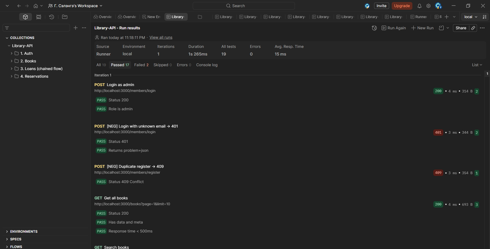

# Б хэсэг — Library Lending REST API

## Ажиллуулах

```bash
npm install
npm start
# → http://localhost:3000
```

## Бизнес дүрмүүд

- Гишүүн нэгэн зэрэг ≤5 ном зээлнэ
- Зээлийн хугацаа 14 хоног
- 1 удаа сунгах боломжтой (+14 хоног)
- Нууц үгэн баталгаажуулалт Bearer токенээр

## Endpoint жагсаалт

| Method | Path | Тайлбар |
|--------|------|---------|
| POST | /members/register | Бүртгүүлэх |
| POST | /members/login | Нэвтрэх, токен авах |
| GET | /books | Номын жагсаалт |
| GET | /books/:id | Ном дэлгэрэнгүй |
| POST | /books | Ном нэмэх (admin) |
| POST | /loans | Ном зээлэх |
| POST | /loans/:id/return | Ном буцаах |
| POST | /loans/:id/extend | Хугацаа сунгах |
| GET | /reservations | Захиалгын жагсаалт |
| POST | /reservations | Захиалах |

## Жишээ хэрэглэгчид (тест)

| И-мэйл | Роль |
|--------|------|
| bat@example.com | member |
| admin@lib.mn | admin |

## Postman тест
`postman/`

Collection run: **17 passed, 2 failed** (19 тестээс)

### Амжилттай тестүүд:
- ✅ Register new member → 201
- ✅ Login as admin → 200  
- ✅ Login unknown email → 401
- ✅ Duplicate register → 409
- ✅ Get all books → 200
- ✅ Search books → 200
- ✅ Get book by id → 200
- ✅ Add book (admin) → 201
- ✅ Book not found → 404
- ✅ Add book no auth → 401
- ✅ Add book as member → 403
- ✅ Borrow book → 201
- ✅ Extend loan → 200
- ✅ Extend again → 409
- ✅ Return book → 200
- ✅ Return again → 409
- ✅ Create reservation → 201